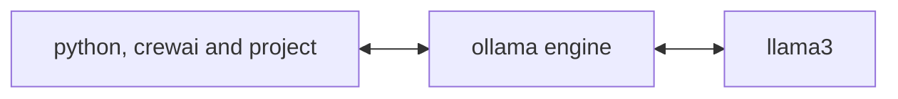

# BuddyAi Crew


This project is based on the course *AI AgentProject with Python by CrewAI* 
we did some changes

* now we have 3 docker containers to avoid install in our local computers, and make it portable,
* we use the llm model llama3 from ollama ( this is free and smaller ) instead of gpt4o from openai.
* our agents read from a txt file instead of pdf document.


## Installation
All is in our docker containers


crewai_slim - This container has python 3.12, and crew ai, also we put our agentic project here

ollama/ollama - In this container we will have ollama engine model

llama3 - Here we have the tiny free LLM llama3 model




### Customizing

**Add your `OPENAI_API_KEY` into the `.env` file**

- Modify `src/buddy_ai/config/agents.yaml` to define your agents
- Modify `src/buddy_ai/config/tasks.yaml` to define your tasks
- Modify `src/buddy_ai/crew.py` to add your own logic, tools and specific args
- Modify `src/buddy_ai/main.py` to add custom inputs for your agents and tasks

## Running the Project

```
docker compose up --build
```

## how to run my crewai agents
```
docker compose start crewai
```

## Monitor the exeecution of my crew
```
docker compose logs -f crewai
```


This command initializes the buddy_ai Crew, assembling the agents and assigning them tasks as defined in your configuration.

This example, unmodified, will run the create a `report.md` file with the output of a research on LLMs in the root folder.

## Understanding Your Crew

The buddy_ai Crew is composed of multiple AI agents, each with unique roles, goals, and tools. These agents collaborate on a series of tasks, defined in `config/tasks.yaml`, leveraging their collective skills to achieve complex objectives. The `config/agents.yaml` file outlines the capabilities and configurations of each agent in your crew.

## Support

For support, questions, or feedback regarding the BuddyAi Crew or crewAI.
- Visit our [documentation](https://docs.crewai.com)
- Reach out to us through our [GitHub repository](https://github.com/joaomdmoura/crewai)
- [Join our Discord](https://discord.com/invite/X4JWnZnxPb)
- [Chat with our docs](https://chatg.pt/DWjSBZn)

Let's create wonders together with the power and simplicity of crewAI.


art.

## links

Github code
https://github.com/canislatranscoxus/ai/buddy_ai

AI AgentProject with Python by CrewAI by Packt Publishing
https://learning.oreilly.com/course/ai-agent-project/9781808089558/
https://github.com/PacktPublishing/AI-Agent-Project-with-Python-CrewAI


