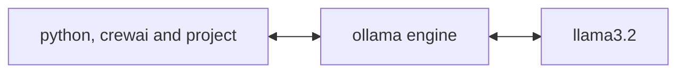

# BuddyAi Crew


This project is based on the course *AI AgentProject with Python by CrewAI*
we create a crew of agents, txt_reader will read a txt file,
next summarizer agent will create a summary of the txt and will write the output in
src/crew_output.txt

we did some changes to the original project:

* now we have 3 docker containers to avoid install in our local computers, and make it portable,
* we use the llm model llama3 from ollama ( this is free and smaller ) instead of gpt4o from openai.
* our agents read from a txt file instead of pdf document.


## Installation
All is in our docker containers


crewai_slim - This container has python 3.12, and crew ai, also we put our agentic project here

ollama/ollama - In this container we will have ollama engine model

llama3 - Here we have the tiny free LLM llama3.2 model




### Customizing

**Add your `OPENAI_API_KEY` into the `.env` file**

- Modify `config/sample_document.txt` this is the document that the agents will read and make a summary about
- Modify `config/agents.yaml` to define your agents
- Modify `config/tasks.yaml` to define your tasks
- Modify `src/crew.py` to add your own logic, tools and specific args
- Modify `src/main.py` to add custom inputs for your agents and tasks


## How to Run and interact with the agents

### terminal 1

```shell
docker compose up --build
```

### terminal 2

```shell
docker exec -it crewai_workspace python -m src.main

```

--------------------------------------------------------------------------------


## create image and containers
```
docker compose up --build
```

## Running the Project

```
docker compose down
docker compose up crewai

```

## View our results
```
cat src/crew_output.txt
```


## Understanding Your Crew

The buddy_ai Crew is composed of multiple AI agents, each with unique roles, goals, and tools. These agents collaborate on a series of tasks, defined in `config/tasks.yaml`, leveraging their collective skills to achieve complex objectives. The `config/agents.yaml` file outlines the capabilities and configurations of each agent in your crew.


## links

Github Coyote style - my updated code for learning and practising.  
https://github.com/canislatranscoxus/ai/tree/main/buddy_ai

AI AgentProject with Python by CrewAI by Packt Publishing
https://learning.oreilly.com/course/ai-agent-project/9781808089558/
https://github.com/PacktPublishing/AI-Agent-Project-with-Python-CrewAI


## Support from the original code of the course

For support, questions, or feedback regarding the BuddyAi Crew or crewAI.
- Visit our [documentation](https://docs.crewai.com)
- Reach out to us through our [GitHub repository](https://github.com/joaomdmoura/crewai)
- [Join our Discord](https://discord.com/invite/X4JWnZnxPb)
- [Chat with our docs](https://chatg.pt/DWjSBZn)
